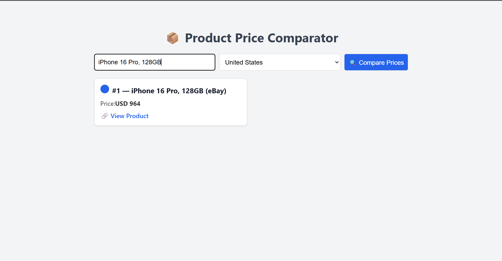

# 📦 Product Price Comparator (React + Node.js)

A full-stack application to fetch and compare product prices across multiple vendors based on country and query — powered by a dummy product dataset.  
The application consists of:

- 🚀 Node.js + Express backend API serving dummy product data  
- ⚛️ React frontend client for querying and displaying sorted product prices  

---

## 📸 Proof of Working

The application has been tested and verified for the following input:

**Request**
```json
{"country": "US", "query": "iPhone 16 Pro, 128GB"}
```

### 📸 Proof Screenshot



### 🎥 Demo Video
[Click to watch demo video](./proof/proof_video.mp4)


---

## 🛠️ Tech Stack

- **Frontend:** React (with Vite)  
- **Backend:** Node.js + Express  
- **Data:** 100-entry dummy dataset  

---

## 📦 Features

- Country selector (`US` & `India`)
- Dynamic product query search  
- Real-time sorting of results by price (ascending)  
- Product rank display (#1, #2…)  
- Error handling and loading state  
- Clean, responsive UI  

---

## ⚙️ Setup & Installation

### 🔧 Prerequisites
- [Node.js](https://nodejs.org/) installed (v18+ recommended)
- npm (comes with Node.js)

---

## 🅱️ Backend Setup

```bash
1️⃣ Open terminal, navigate to backend/
cd backend

2️⃣ Install dependencies:
npm install

3️⃣ Start the server:
node server.js

API now running at http://localhost:5000/api/prices
```

## 🅵 Frontend Setup

```bash
1️⃣ Open a new terminal, navigate to frontend/
cd frontend

2️⃣ Install dependencies:
npm install

3️⃣ Start the Vite development server:
npm run dev

Frontend now running at http://localhost:5173
```

# 📦 Price Comparison API

A simple REST API that fetches product pricing details from various sources, sorted by ascending price.

---

## 📑 API Documentation

### 📌 Endpoint

`GET /api/prices`

---

### 📄 Query Parameters

| Parameter | Type   | Description                            |
|:------------|:--------|:----------------------------------------|
| `query`      | string | Product name or keyword (**required**)     |
| `country`    | string | Country code: `US` or `IN` (**required**) |

---

### 📦 Example Request

```bash
GET http://localhost:5000/api/prices?query=iPhone&country=US

📤 Response Format
[
  {
    "productName": "iPhone 16 Pro 128GB (Apple Store)",
    "price": "999",
    "currency": "USD",
    "country": "US",
    "link": "https://applestore.com/product/iphone-16-pro-128gb"
  },
  ...
]
```

✅ Results are sorted in ascending price order

✅ Ranks are assigned on the frontend display

---

### 📊 Dummy Data Details

```bash
1️. 100 product entries generated dynamically using:

2. 20 popular product types

3. 7 major stores (Apple, Amazon, eBay, Walmart, Flipkart, Croma)

4. 2 countries (US, IN)

5. Randomized prices and links

6. Data source: backend/data/dummyProducts.js
```


# ✅ Testing Instructions

### 📥 Install Node.js  
**(v18+ recommended)**

---

### 📦 Clone this repository:

```bash
git clone https://github.com/your-username/product-price-comparator.git
cd product-price-comparator

🖥️ Start Backend:
cd backend
npm install
node server.js

🎨 Start Frontend:
cd frontend
npm install
npm run dev

http://localhost:5173
```

---

## 🔍 Test the app:
✅ Enter product queries like:

iPhone

MacBook

PlayStation

✅ Choose a country from the dropdown:

India

US

✅ See results sorted by price with rank numbers

✅ Click product links to navigate to vendor pages


